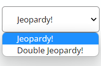
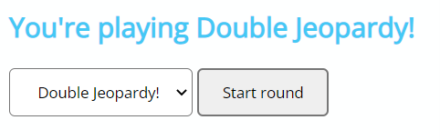
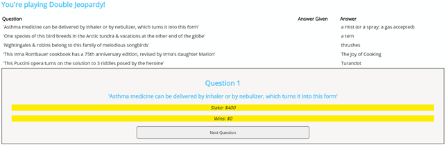
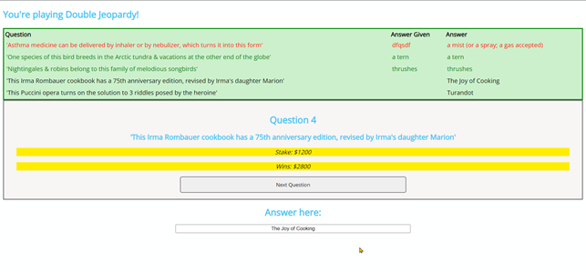
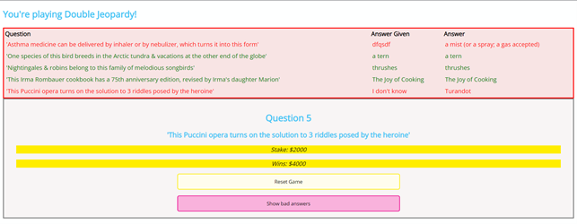
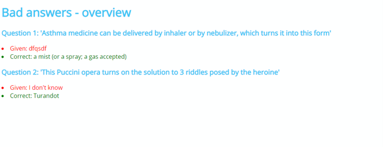

# Examen WFA JH1 AJ 21-22: Jeopardy

## Algemene instructies examen
Dit examen bestaat uit 5 deelopdrachten met telkens een hogere moeilijkheidsgraad. Werk de opdrachten in volgorde af om efficiënt te werken.
* Er werd reeds HTML en CSS voorzien, volg aandachtig de opdrachtomschrijving om onmiddellijk een mooie opmaak te krijgen. 
* Het is toegelaten om de CSS aan te passen. **De HTML behoudt zijn oorspronkelijke structuur, maar het is toegelaten om indien nodig attributen aan de reeds bestaande elementen toe te voegen.**
* Het examen is open boek, dit betekent dat je de volledige cursus kan gebruiken, alsook alle oefeningen die tijdens de lessenreeks werden gebruikt en online bronnen.
* Iedere vorm van samenwerking is verboden.
* Maak regelmatig (per functionaliteit) een commit en push naar je online repo. Commit volgens de algemene afspraken.

Dit examen maakt **60%** uit van de evaluatie voor de module Web Frontend Advanced.

### Scoringstabel

|Beoordeling|Punten|
|-----------|:------:|
|Naleven conventies|2|
|DOM manipulatie|2|
|Formulierelementen|2|
|Codekwaliteit|7|
|Pijlers van een Webapplicatie (CSS, HTML, JavaScript)|1|
|Events|2|
|Gebruik Git(Hub)|1|
|JSON uitlezen|4|
|Weergeven data|6|
|Kennis array-functions|4|
|Algehele progressie (aantal afgewerkte opdrachten)|4|
|**TOTAAL**|**35**|

Teken af op de aanwezigheidslijst.
Iedere vaststelling van onregelmatigheid (o.a. GSM, spieken, afkijken) wordt conform het OER gemeld aan de betrokken student en aan de voorzitter van de examencommissie.
**Veel succes!**

## Examenopgave
Maak een interactieve Quizapplicatie waarin willekeurige vragen per ronde worden gesteld. De vragen zijn onderverdeeld in rondes Jeopardy! en Double Jeopardy!. **Deze rondes bepalen enkel welke soort vragen er gekozen zullen worden en hebben verder geen invloed op de applicatie.** Bij een correct antwoord wordt de winst berekend en verhoogd, bij een foutief antwoord wordt de vraag, het ingegeven antwoord en het correcte antwoord bijgehouden en weergegeven in een tabel en op een andere pagina.

### Opdracht 1: Dropdown vullen met rondes (Jeopardy! en Double jeopardy!)
Lees de data met vragen uit. Kies hiervoor één van deze twee manieren om de data uit te lezen:
* Gebruik ofwel GitHub Pages om `docs/api/data.json` uit te lezen (online uitlezen)
* … of gebruik de `js/data.js` (lokaal uitlezen)
Het uitlezen via een online bron (Github Pages) levert een iets hogere score op.

De data bevat een json-object waarin de vragen gecatalogeerd worden met een ronde (`round`). We onderscheiden Jeopardy! of Double Jeopardy!. Haal de unieke rondes uit de data. Eens je de unieke rondes hebt, vul je het `select`-element met id `jeopardy-type` op met deze unieke rondes.

### Opdracht 2: Weergeven keuze
Wanneer een gebruiker een ronde heeft geselecteerd, wordt de ronde weergegeven als `H1` in de  header met id `jeopardy-type-choice`. Maak hier gebruik van het passend HTML-element en diens attributen.

### Opdracht 3: Vragenlijst samenstellen + vragen weergeven
Na het klikken op de knop ‘Start round’ worden er 5 willekeurige en unieke vragen binnen de geselecteerde ronde gekozen. 
_Tip_: Plaats deze 5 willekeurige vragen in een nieuwe array.

Geef de geselecteerde vragen weer in de section met id `question-overview`. **Zorg ervoor dat je reeds alle vragen mét het juiste antwoord kan zien.**

Hoe je de vragen weergeeft, mag je vrij kiezen, maar zorg ervoor dat dit overzichtelijk gebeurt. Hier wordt gekozen voor een tabel.

Eenmaal je het overzicht hebt van de vragen die zullen gesteld worden, zorg er ervoor dat de eerste vraag onmiddellijk gesteld wordt. Doe dit door de eerste vraag weer te geven in de section met id `question-zone`.

De volgende items worden weergegeven in de vraag:
* De vraagnummer (weergeven als `h2`)
* De vraag zelf (weergegeven als `h3`)
* De mogelijke winst van de vraag (weergeven met CSS-klasse `mark`)
* De winst die tot nu toe gewonnen is tijdens het spelen van het spel (weergeven met CSS-klasse `mark`)
* Een `knop` om het ingegeven antwoord te valideren en vervolgens de volgende vraag te tonen.

Ontwerp voor bovenstaande een functie `createQuestion()`.

### Opdracht 4: Valideren van het antwoord
De vragen worden in volgorde gesteld. Een gebruiker kan een antwoord indienen door in de input met id `answer` het antwoord in te tikken (ter info: deze kan je dus spieken …).

Waarneer hij klikt op de knop ‘Next Question’ (die je zelf in de vorige stap maakte), dan wordt het antwoord ingediend en gevalideerd.

De tabel uit de vorige opdracht (of jouw eigen uitwerking) wordt vervolgens geüpdatet. Indien de vraag juist beantwoord werd, dan zorg je ervoor dat het antwoord en de achtergrond van de tabel gemarkeerd worden in het groen. Foutieve antwoorden markeer je rood.

### Opdracht 5: Einde van het spel
Nadat alle 5 vragen zijn beantwoord, **verdwijnt** de knop om naar de volgende vraag te gaan. In de plaats worden er twee nieuwe knoppen zichtbaar: een knop om te resetten en een knop om de foute vragen te bekijken.

#### Resetten
Zorg ervoor dat het mogelijk wordt om, na het klikken op de resetknop, het spel helemaal opnieuw te beginnen.
Hou rekening met:
* Het winstbedrag
* Het verwijderen van de tabel
* Het verwijderen van de array met de 5 willekeurige, unieke vragen
* …
Ontwerp voor bovenstaande een functie `resetGame()`.

#### Foutieve antwoorden tonen
Bij klikken over deze knop:
* Worden de slecht beantwoorde vragen bewaard in de `local storage`.
* Wordt de gebruiker omgeleid naar `summary.html` (zelf aan te maken), waar je een overzicht te zien krijgt met alle foutief beantwoorde vragen samen met het juiste antwoord. Plaats dit in een section met id `summary-feedback`.
Zorg ervoor dat de vragen volgens lengte van de vraag worden weergegeven. De langste komt dus eerst.
Gebruik hiervoor een **higher order function**.

Plaats alle scripts voor deze vraag in `scriptSummary.js` (zelf aan te maken).

